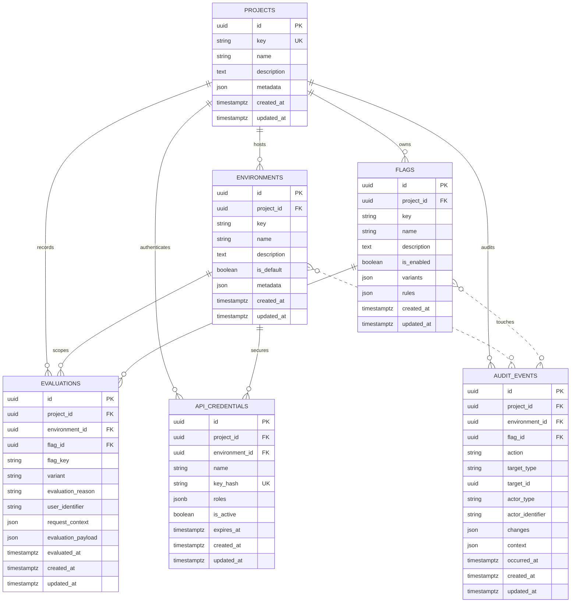

# Schema Overview

Date: 2025-10-11

This document captures the current relational model for Phlag based on the Laravel migrations in `database/migrations`. Use it to orient yourself when extending the domain or crafting new database queries.

## Relationship Notes

- `environments`, `flags`, and `evaluations` cascade on project deletion; derived records disappear with the parent project.
- Evaluations belong to a single environment/flag pair and capture request metadata for debugging.
- Audit events may reference a project, environment, and/or flag (all optional) to describe the scope of the change.
- API credentials store SHA-256 hashes of project/environment API keys so only hashed material lands in Postgres. Seeders mint demo credentials only when `PHLAG_DEMO_API_KEY` is defined. Tokens cannot be issued when a credential is inactive or past its optional expiration.
- API credential records include a human-friendly name and optional role list; permissions are resolved from these roles at runtime when issuing JWTs.

## Keeping the Diagram Updated

1. Review new or modified migrations under `database/migrations`.
2. Update the entity attributes or relationships in the Mermaid definition above.
3. Preview the diagram locally (e.g., VS Code Markdown preview or Mermaid Live Editor) before committing.

When introducing new tables, add them to the diagram and describe any cascading behavior or key constraints so future contributors can reason about the schema quickly.
